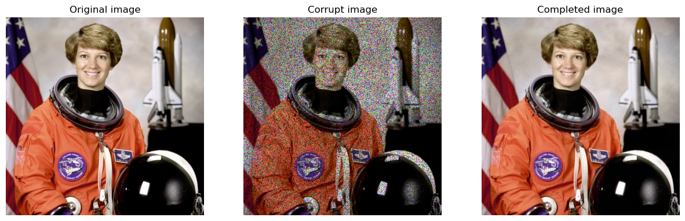

# Image Reconstruction by Matrix Completion

The aim of [this](code.ipynb) notebook is to reconstruct a corrupted image by matrix completion using the **Singular Value Thresholding** (SVT) algorithm.
 
 
 

*Figure 1: Original and reconstructed images*
